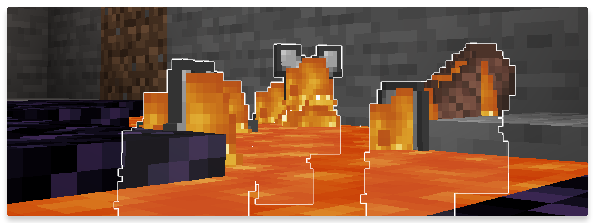
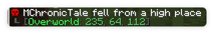
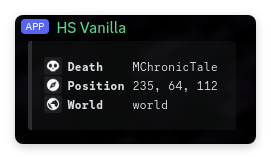

# Hydeath
เมื่อเวลาคุณตายไอเท็มของคุณจะเรืองแสง (ยกเว้น Bedrock)
ไอเท็มเหล่านี้ที่ดรอปจากการตายจะไม่มีวันหายยกเว้นจะลงไปใน void

ทนไฟ, ลาวา, กระบองเพรช, ระเบิด, monstor ยิบไม่ได้, ไม่มีวันหาย

:::info
ผู้เล่นอื่นจะไม่สามารถเก็บของจากศพของคุณได้จนกว่าเจ้าของศพจะพิมพ์ `/unlock`
:::

เมื่อคุณตายจะมีตำแหน่งบอกในแชททั้งในเกมและดิสคอร์ส

