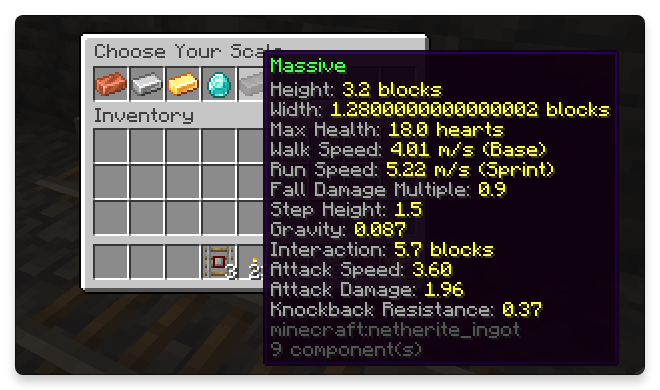
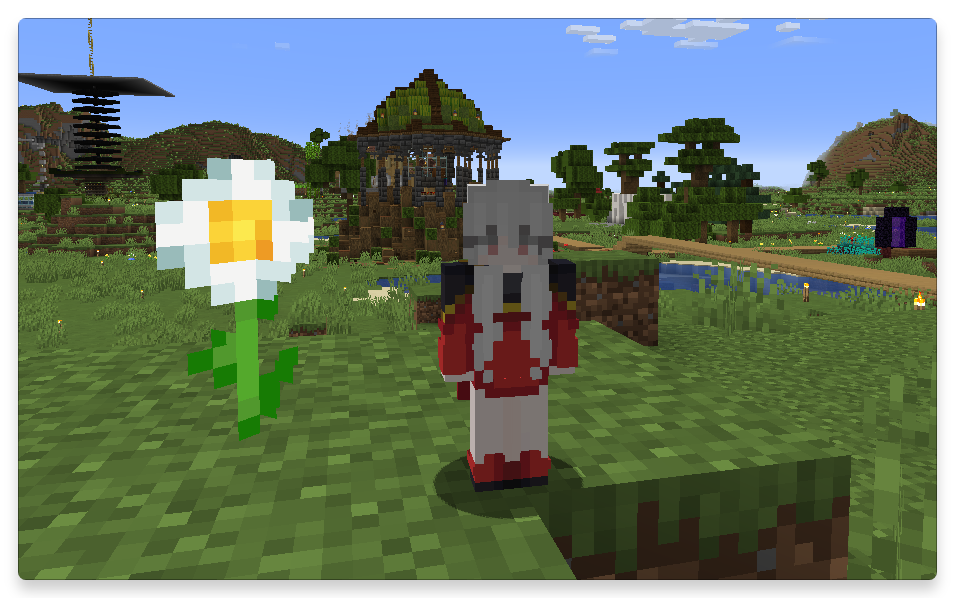
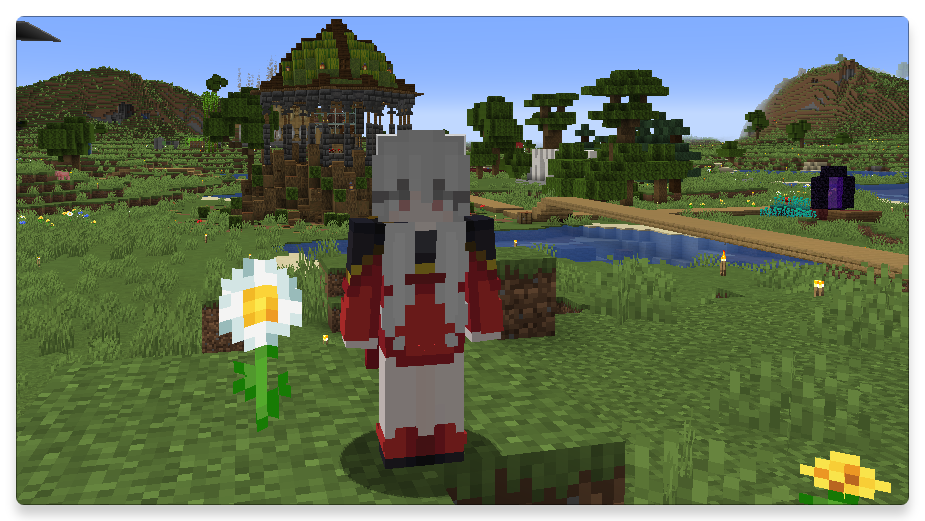
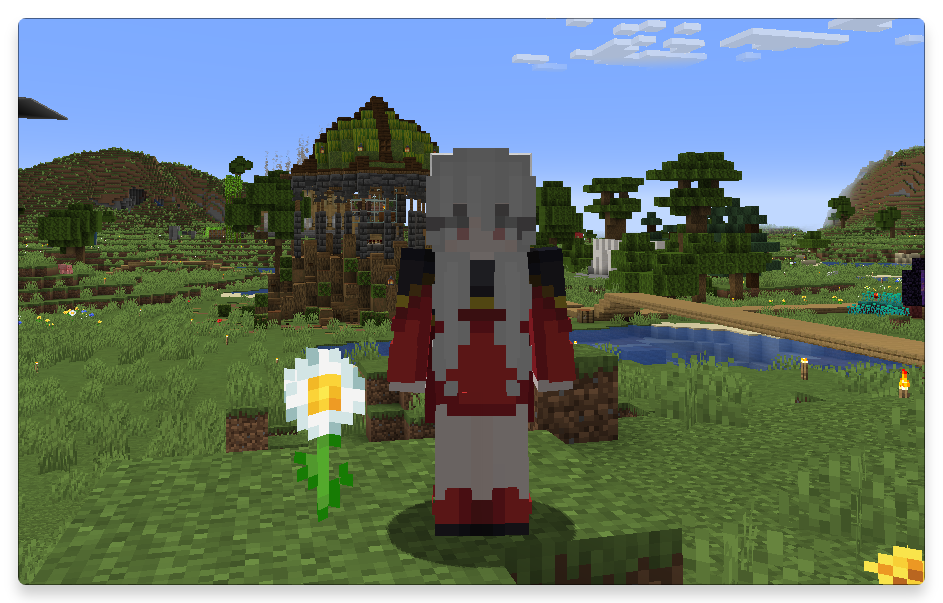
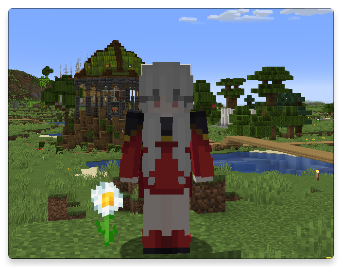
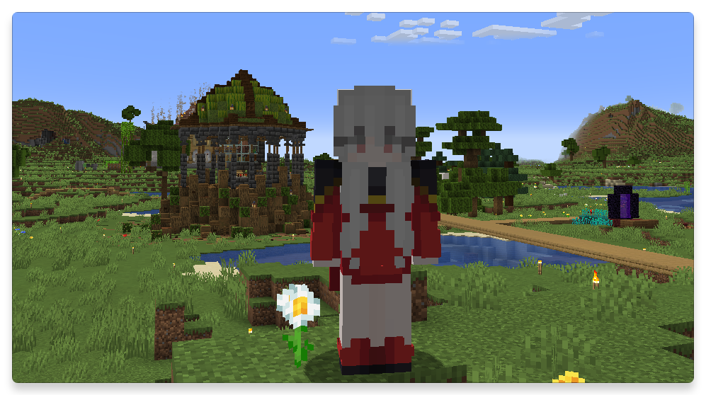

# Sacleshifter
สามารถให้ผู้เล่นเลือกขนาดตัวละครได้

มีเข้ามาครั้งแรกจะมี gui ให้เลือกขนาดตัว


สารารถคราฟ Scale of orb เพื่อเลือกใหม่ได้
<code-preview>

```
<div class="crafting-table">
    
    
    
    
    
    
    
    
    
    
    <div class="result-slot">
      
      <div class="itemx-count">1</div>
    </div>
  </div>

```

</code-preview>

<script setup>
    import CodePreview from '../components/CodePreview.vue'
</script>


## ขนาดตัว tiny


## ขนาดตัว small


## ขนาดตัว normal


## ขนาดตัว large


## ขนาดตัว massive

